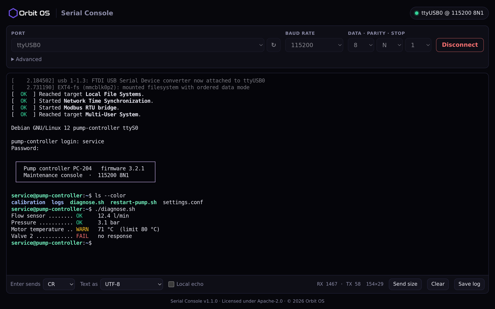
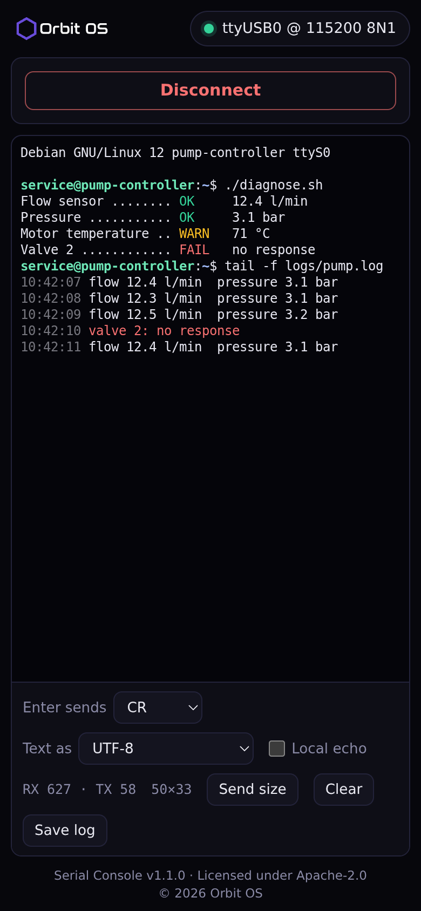

<p align="center">
  
</p>

<h1 align="center">Serial Console for Orbit OS</h1>

<p align="center"><b>A serial terminal in your browser — reach a device's UART over the network, no USB cable to your laptop.</b></p>

An [Orbit OS](https://www.orbit-os.org/?ref=github-serial-console) app that brings the classic serial console (PuTTY, minicom) to the browser. Pick a UART port on the device, set the baud rate and talk to whatever is connected to it — boot logs, maintenance shells, GPS modules, industrial equipment — from any computer on the network.

It is also a compact example of the **Orbit OS UART API**: list ports, open one, stream incoming bytes and write to it with the [Orbit OS Go SDK](https://github.com/OrbitOS-org/orbit-os-sdk-go).

Runs on Raspberry Pi, Arduino UNO Q and other ARM64 devices with Orbit OS (free Community Edition).

<p align="center">
  
  
</p>

## Features

- **Pick the port from a list** — the app asks the device for its UART ports (`ttyS0`, `ttyUSB0`, …); you can also type a name
- **Connection settings** — baud rate (common values or custom), data bits 5–8, parity N/E/O, stop bits 1/2; remembered for the next visit
- **A real terminal emulator** ([xterm.js](https://xtermjs.org/)) — colours, cursor movement and full-screen programs such as `nano`, `vi`, `top` or `menuconfig` display as in a desktop terminal; boxes and logos made of characters line up
- **Full keyboard** — arrows, function keys, Tab, Ctrl+C and the other control keys; copy with Ctrl+C when text is selected (or Ctrl+Shift+C), paste with Ctrl+V
- **Scrollback** of 10 000 lines; scroll up to read while data keeps arriving
- **Send size** — a serial line does not carry the window size, so this button types `stty cols … rows …` into the shell for you
- **Enter key mode** — CR, LF or CR+LF
- **Local echo** for equipment that does not echo what you type
- **UTF-8 or Latin-1 / raw 8-bit**, for both received and sent text
- **Byte counters**, **Clear** and **Save log** (the terminal text as a file)
- Works on a phone: while connected, the settings fold away and the terminal takes the screen
- **Works through remote access too** — where a WebSocket cannot reach the device (for example through [Orbit Connect](https://store.orbit-os.org/app/tun?ref=github-serial-console)), the console switches by itself to plain HTTP requests
- One session at a time, so two browser tabs never fight over the same port

## Install

**From the Orbit OS Store (recommended):** install [Serial Console](https://store.orbit-os.org/app/serial-console?ref=github-serial-console) on your device in one click.

<a href="https://store.orbit-os.org/app/serial-console?ref=github-serial-console"></a>

**From source — recommended: [Orbit Studio](https://marketplace.visualstudio.com/items?itemName=orbit-os.orbit-studio) (VS Code):**

You need [VS Code](https://code.visualstudio.com/) with the Orbit Studio extension and **[Go](https://go.dev/dl/) 1.25 or newer** installed (`go` on your PATH).

1. Clone the repository and open the folder in VS Code with the Orbit Studio extension:
   ```bash
   git clone https://github.com/OrbitOS-org/orbit-os-app-serial-console
   code orbit-os-app-serial-console
   ```
2. In the Orbit sidebar, run **Add / Update SDK** and set your device's IP.
3. Use **Run** to try it live against a device in Developer Mode, then **Build + Deploy** to install the signed `.orb`.

**Without Orbit Studio:** unpack the [SDK release](https://github.com/OrbitOS-org/orbit-os-sdk-go/releases/tag/v26.0.3) into `orbit-os-sdk-go/`, then `go build ./cmd/serial_console` builds the binary — use Orbit Studio to package and sign the `.orb`.

## Getting started

1. Open the device portal at `http://<DEVICE_IP>`, sign in, and open **Serial Console** from the Launcher.
2. Choose the UART port and the baud rate of the equipment. Use the refresh button if you plugged in an adapter after opening the page.
3. Press **Connect** and type — received data appears as it arrives.

## Development (Orbit Studio)

This project follows the standard [Orbit Studio](https://marketplace.visualstudio.com/items?itemName=orbit-os.orbit-studio) layout:

| Path | What |
|---|---|
| `cmd/serial_console/` | app source — `main.go` (HTTP + WebSocket server, UART bridge), `httplink.go` (the same console over plain HTTP requests, with its tests), `page.html` and `style.css` (web UI), `metadata.json` (manifest & permissions) |
| `cmd/serial_console/static/xterm/` | xterm.js 6.0.0 with its fit (0.11.0) and WebGL (0.19.0) add-ons, unmodified, built into the binary — the page loads nothing from the internet |
| `cmd/serial_console/orb/icon.svg` | launcher / Store icon |
| `orbit.project.json` | Orbit Studio project settings |

- **Recommended workflow:** open the folder in VS Code with Orbit Studio, **Add / Update SDK** (downloads the SDK into `orbit-os-sdk-go/`, which is not in the repository), then **Run** to develop against a device in Developer Mode, or **Build + Deploy** to install the `.orb`.
- The project builds against that local SDK copy (`go.mod` and `go.work` point to it).
- The `-host <DEVICE_IP>` flag is only used when running off-device (development); on the device the SDK connects locally. With **Run**, the page is served on your computer at `http://127.0.0.1:<port>`, with the port shown in the log.
- Development TLS certificates live in `cmd/certs/grpc/` and are never committed.

## Security

- The web page and the WebSocket listen on `127.0.0.1` only and are reached through the Orbit OS Launcher, at `http://<DEVICE_IP>/console`, behind the device login. They are not reachable directly from the network.
- The app takes a port in the reserved range 50000–60000 (starting at 50002) and moves to the next one when a port is taken.
- The console (WebSocket, or HTTP requests when a WebSocket cannot get through) only accepts the app's own page: the page carries a random token, new each time the app starts, and sends it with every request.
- A serial console often gives a shell on the connected equipment — treat access to this app like access to that equipment.
- Permissions used: `UartService`, `AppHubService`, `SystemService`.

## Acknowledgments

- The terminal is [xterm.js](https://github.com/xtermjs/xterm.js) with its fit and WebGL add-ons (MIT) — the same emulator used by VS Code.
- WebSocket support uses [gorilla/websocket](https://github.com/gorilla/websocket) (BSD-2-Clause).

## Links

[App in the Store](https://store.orbit-os.org/app/serial-console?ref=github-serial-console) · [Orbit OS](https://www.orbit-os.org/?ref=github-serial-console) · [Getting started](https://www.orbit-os.org/getting_started.html?ref=github-serial-console) · [SDK reference](https://www.orbit-os.org/api-reference.html?ref=github-serial-console) · [Forum](https://forum.orbit-os.org/?ref=github-serial-console) · info@orbit-os.org

## License

Apache-2.0 — see [LICENSE](LICENSE) and [NOTICE](NOTICE).
