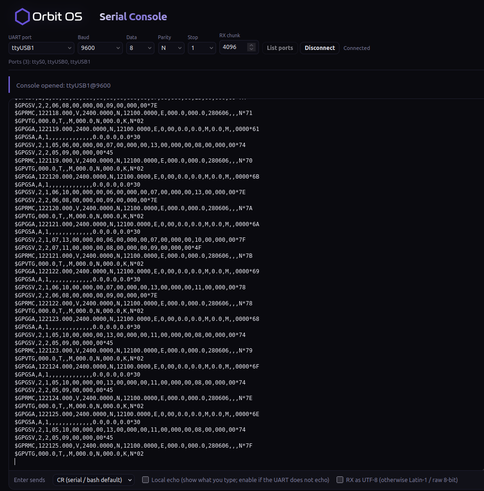

<p align="center">
  
</p>

<h1 align="center">Serial Console for Orbit OS</h1>

<p align="center"><b>A serial terminal in your browser — reach a device's UART over the network, no USB cable to your laptop.</b></p>

An [Orbit OS](https://www.orbit-os.org/?ref=github-serial-console) app that brings the classic serial console (PuTTY, minicom) to the browser. Pick a UART port on the device, set the baud rate and talk to whatever is connected to it — boot logs, maintenance shells, GPS modules, industrial equipment — from any computer on the network.

It is also a compact example of the **Orbit OS UART API**: list ports, open one, stream incoming bytes and write to it with the [Orbit OS Go SDK](https://github.com/OrbitOS-org/orbit-os-sdk-go).

Runs on Raspberry Pi, Arduino UNO Q and other ARM64 devices with Orbit OS (free Community Edition).

<p align="center">
  
</p>

## Features

- **Pick the port from a list** — the app asks the device for its UART ports (`ttyS0`, `ttyUSB0`, …)
- **Connection settings** — baud rate (common presets or custom), data bits 5–8, parity N/E/O, stop bits 1/2
- **Real-time terminal** over WebSocket, with full keyboard support
- **Enter key mode** — CR, LF or CR+LF
- **Local echo** for devices that don't echo what you type
- **UTF-8 or Latin-1 / raw 8-bit** display of received bytes
- One session at a time, so two browser tabs never fight over the same port

## Install

**From the Orbit OS Store (recommended):** install [Serial Console](https://store.orbit-os.org/app/serial-console?ref=github-serial-console) on your device in one click.

<a href="https://store.orbit-os.org/app/serial-console?ref=github-serial-console"></a>

**From source — recommended: [Orbit Studio](https://marketplace.visualstudio.com/items?itemName=orbit-os.orbit-studio) (VS Code):**

You need [VS Code](https://code.visualstudio.com/) with the Orbit Studio extension and **[Go](https://go.dev/dl/) 1.25 or newer** installed (`go` on your PATH).

1. Clone the repository and open the folder in VS Code with the Orbit Studio extension:
   ```bash
   git clone https://github.com/OrbitOS-org/orbit-os-app-serial-console
   code orbit-os-app-serial-console
   ```
2. In the Orbit sidebar, run **Add / Update SDK** and set your device's IP.
3. Use **Run** to try it live against a device in Developer Mode, then **Build + Deploy** to install the signed `.orb`.

**Without Orbit Studio:** `go build ./cmd/serial_console` builds the binary with the published SDK module — use Orbit Studio to package and sign the `.orb`.

## Getting started

1. Open **Serial Console** from the AppHub on your device (`http://<DEVICE_IP>`).
2. Press **List ports**, choose the UART port and the baud rate of the equipment.
3. Press **Connect** and type — received data appears as it arrives.

## Development (Orbit Studio)

This project follows the standard [Orbit Studio](https://marketplace.visualstudio.com/items?itemName=orbit-os.orbit-studio) layout:

| Path | What |
|---|---|
| `cmd/serial_console/` | app source — `main.go` (HTTP + WebSocket server, UART bridge), `page.html` and `style.css` (web UI), `metadata.json` (manifest & permissions) |
| `cmd/serial_console/orb/icon.svg` | launcher / Store icon |
| `orbit.project.json` | Orbit Studio project settings |

- **Recommended workflow:** open the folder in VS Code with Orbit Studio, **Add / Update SDK** (creates the local `orbit-os-sdk-go/` copy and `go.work`, both git-ignored), then **Run** to develop against a device in Developer Mode, or **Build + Deploy** to install the `.orb`.
- Without Orbit Studio, `go build` uses the published SDK module [`github.com/OrbitOS-org/orbit-os-sdk-go/v26`](https://pkg.go.dev/github.com/OrbitOS-org/orbit-os-sdk-go/v26). The `-host <DEVICE_IP>` flag is only used when running off-device (development); on the device the SDK uses the local Unix socket.
- Development TLS certificates live in `cmd/certs/grpc/` and are never committed.

## Security

- The web server listens on **all interfaces, port 9002, with no login of its own**: anyone who can reach the device on that port can open the console and talk to the serial port. Use it on trusted networks, or block port 9002 in the device firewall (Settings → Firewall) and use the AppHub entry, which sits behind the device login.
- A serial console often gives a shell on the connected equipment — treat access to this app like access to that equipment.
- Permissions used: `UartService`, `AppHubService`, `SystemService`.

## Acknowledgments

WebSocket support uses [gorilla/websocket](https://github.com/gorilla/websocket) (BSD-2-Clause).

## Links

[App in the Store](https://store.orbit-os.org/app/serial-console?ref=github-serial-console) · [Orbit OS](https://www.orbit-os.org/?ref=github-serial-console) · [Getting started](https://www.orbit-os.org/getting_started.html?ref=github-serial-console) · [SDK reference](https://www.orbit-os.org/api-reference.html?ref=github-serial-console) · [Forum](https://forum.orbit-os.org/?ref=github-serial-console) · info@orbit-os.org

## License

Apache-2.0 — see [LICENSE](LICENSE) and [NOTICE](NOTICE).
